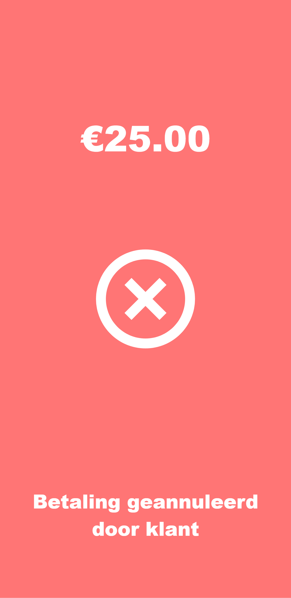

# Payconiq Payment Terminal

A web-based payment terminal integration with Payconiq for Scouts Waregem. This application provides a simple interface for creating QR code payments and handling real-time payment status updates.

## Features

- **Simple Payment Interface**: Choose from preset amounts or enter custom amounts
- **QR Code Generation**: Automatically generates Payconiq QR codes for payments
- **Real-time Updates**: Live payment status updates using WebSockets
- **Payment Management**: Cancel payments and handle various payment states
- **Responsive Design**: Works on desktop and mobile devices

## Screenshots

| Create Payment | Scan Payment | Payment Succeeded | Payment Failed |
|----------------|--------------|-------------------|----------------|
|  |  |  |  |

## Prerequisites

- Node.js (v14 or higher)
- Payconiq Business Account
- SSL certificate (required for Payconiq callbacks)

## Installation

1. Clone the repository:
```bash
git clone https://github.com/yourusername/payconiq-scouts-waregem.git
cd scouts_payments
```

2. Install dependencies:
```bash
npm install
```

3. Create a `.env` file in the root directory:
```env
PAYCONIQ_BEARER=your_payconiq_bearer_token_here
AMOUNTS=5;10;15;20;30;50
```

**Environment Variables:**
- `PAYCONIQ_BEARER` (required): Your Payconiq API bearer token
- `AMOUNTS` (optional): Semicolon-separated list of 6 payment amounts in euros. Defaults to `5;10;15;20;30;50` if not provided or invalid

4. Start the application:
```bash
npm start
```

## Usage

1. **Select Amount**: Choose from preset amounts (configurable via AMOUNTS environment variable) or enter a custom amount
2. **Generate QR Code**: The system automatically creates a Payconiq QR code
3. **Customer Payment**: Customer scans the QR code with their banking app
4. **Real-time Status**: Payment status updates automatically via WebSocket connection
5. **Completion**: Success or failure confirmation is displayed

## API Endpoints

### GET `/payment?amount={amount}`
Creates a new payment request.

**Parameters:**
- `amount` (required): Payment amount in euros

**Response:**
```json
{
  "paymentId": "payment-uuid",
  "qrCode": "https://qrcodegenerator.api.bancontact.net/qrcode?c=...&f=svg"
}
```

### POST `/payment/callback`
Webhook endpoint for Payconiq payment status updates.

### POST `/payment/cancel`
Cancels an active payment.

**Body:**
```json
{
  "paymentId": "payment-uuid"
}
```

## Architecture

The application consists of:

- **Express.js Backend**: Handles API requests and Payconiq integration
- **Socket.io**: Provides real-time communication for payment status updates
- **Pug Templates**: Server-side rendering for the frontend
- **Vanilla JavaScript**: Client-side payment interface logic

## Security Features

- **JWT Verification**: All Payconiq callbacks are verified using JOSE
- **Payment Expiration**: Payments automatically expire after 20 minutes
- **Secure Headers**: Proper security headers for API requests


## License

This project is licensed under the MIT License.
